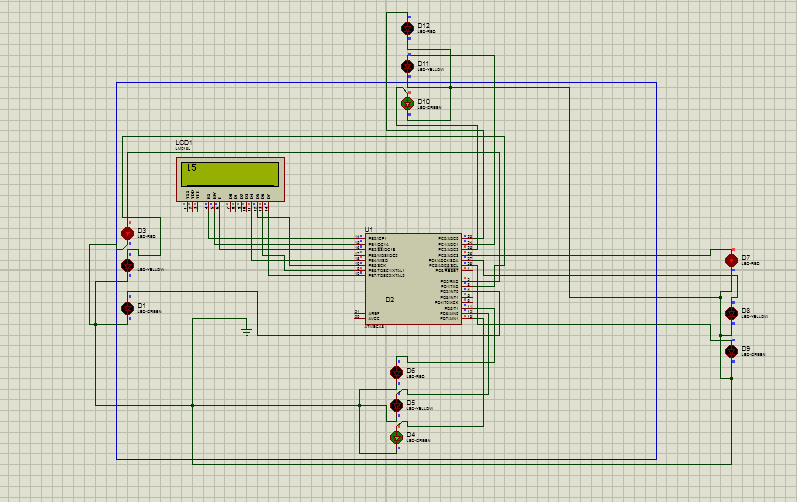

## Simple Traffic Signal Indicator in atmega8 microcontroller

### Requirements
* Proteus 8
* Atmel Studio 6
### Instruction is used in both application
* For Proteus
	1. atmega8 microprocessor
	2. LED Lights
	3. LCD display
* For atmel studio
	1. lcd_lib.h
	2. lcd_lib.c